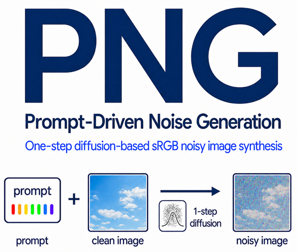
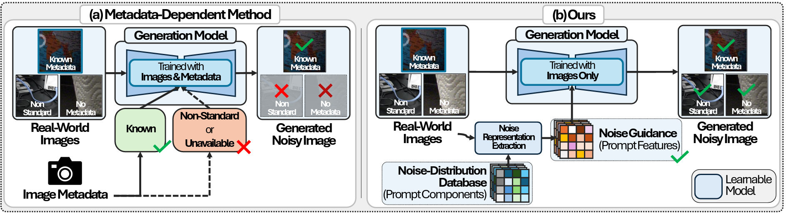
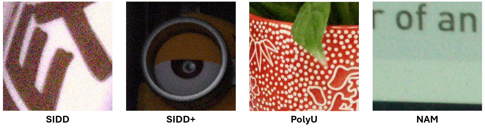
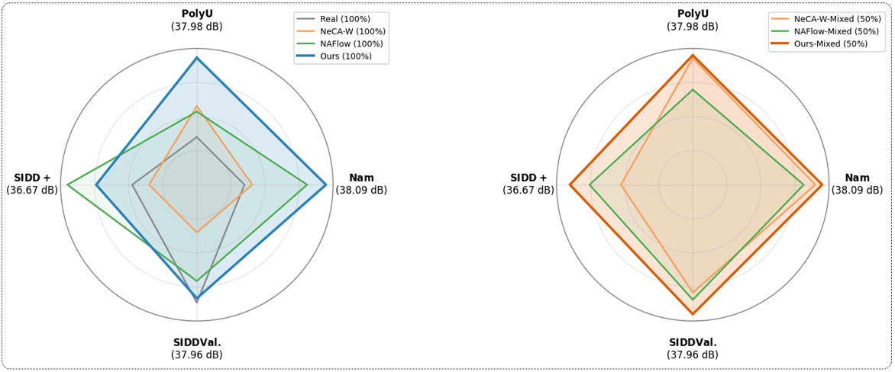

<div align="center">

<h1>Diffusion-Based sRGB Real Noise Generation<br>via Prompt-Driven Noise Representation Learning<br>(CVPR 2026 Highlight)</h1>

<h4>
  <a href="https://scholar.google.com/citations?user=NBs5cTMAAAAJ">Jaekyun Ko</a>*,
  <a href="https://dongjinkim9.github.io">Dongjin Kim</a>*,
  <a href="https://scholar.google.com/citations?user=Z3B180AAAAAJ&hl=en">Soomin Lee</a>,
  <a href="https://scholar.google.com/citations?user=I_5aoAwAAAAJ&hl=en">Guanghui Wang</a>,
  <a href="https://sites.google.com/view/lliger9/team/taehyunkim">Tae Hyun Kim<sup>&#8224;</sup></a>
</h4>

<b><sub><sup>* Equal contribution.  <sup>&#8224;</sup> Corresponding author.</sup></sub></b>

[](https://arxiv.org/abs/2603.04870)

</div>

---

<div align="center">



<i>We introduce Prompt-Driven Noise Generation (PNG), a diffusion-based framework for realistic sRGB noise synthesis. PNG learns prompt-driven noise representations from real noisy-clean pairs and generates diverse noisy images that follow the input noise distribution without relying on explicit camera metadata.</i>

</div>

## 📦 Installation

```bash
git clone https://github.com/JK-the-Ko/PNG.git
cd PNG
conda env create --file env.yaml
conda activate torch-lightning
```

## 📁 Dataset Preparation

PNG uses real-world denoising datasets for training and evaluation. Download the datasets from the links below, then set the dataset root path (`dataroot`) in the dataset configuration files under `configs/datasets`.

| Dataset Type | Dataset | Download | Configuration |
| :----------: | :-----: | :------: | :------------ |
| Training | SIDD | [Download](https://drive.google.com/file/d/1cdWUmm7WYcAdpl6Ptf2D5j0nlPy_0WCo/view?usp=drive_link) | `configs/datasets/train/sidd_train.yaml` |
| Training | SIDD for P-DiT / CM | [Download](https://drive.google.com/file/d/1cdWUmm7WYcAdpl6Ptf2D5j0nlPy_0WCo/view?usp=drive_link) | `configs/datasets/train/sidd_cm_train.yaml` |
| Training | SIDD for classifier | [Download](https://drive.google.com/file/d/1cdWUmm7WYcAdpl6Ptf2D5j0nlPy_0WCo/view?usp=drive_link) | `configs/datasets/train/sidd_classifier_train.yaml` |
| Validation | SIDD | [Download](https://drive.google.com/file/d/18qzVfQlEM9fP8wOb9GH28ZEgC8dBT7-N/view?usp=drive_link) | `configs/datasets/val/sidd_val.yaml` |
| Validation | SIDD+ | [Download](https://drive.google.com/file/d/1lvWiU3c67QRqo6lLk1Pq7-TAASaFb9xF/view?usp=drive_link) | `configs/datasets/val/siddplus_val.yaml` |
| Validation | PolyU | [Download](https://drive.google.com/file/d/1M2mz-R1eHFTZ95ufc7Dt4Td7jfaWgiR-/view?usp=drive_link) | `configs/datasets/val/polyu_val.yaml` |
| Validation | Nam | [Download](https://drive.google.com/file/d/1poiuuW5CBUf-qr5T38SJw-d_zMJyT5ir/view?usp=drive_link) | `configs/datasets/val/nam_val.yaml` |

Example dataset configuration:

```yaml
dataset:
  target: png.datasets.sidd.SIDDDataset
  params:
    dataroot: <PATH_TO_DATASET>
```

## 🔗 Pretrained Checkpoints

Download the pretrained checkpoints from the links below. After downloading, update the checkpoint paths in the corresponding configuration files before running validation or generation.

| Model | Download | Used For | Configuration |
| :---: | :------: | :------- | :------------ |
| Prompt Autoencoder | [Download](https://drive.google.com/file/d/1Bz-mHFFGzju1elzS6JV3XDdA45mryqWU/view?usp=drive_link) | Prompt representation extraction and validation | `configs/val/prompt_ae/val_lit_prompt_ae.yaml` |
| Prompt-Driven Noise Generator | [Download](https://drive.google.com/file/d/1Ry46H1BjgKGPLKCNMj89VtmS9ouRHWUS/view?usp=drive_link) | Noise generation and validation | `configs/val/prompt_cm/val_lit_prompt_cm.yaml` |
| Denoiser | [Download](https://drive.google.com/file/d/1_jshAtciBa_-_2HLTsbxVvk4CGZMT--h/view?usp=sharing) | Denoising evaluation | `configs/val/denoiser/val_lit_denoising.yaml` |

Example checkpoint configuration:

```yaml
model:
  pl_resume: <PATH_TO_CHECKPOINT>
```

## 🏋️ Training & Evaluation

### A. Train Prompt Autoencoder

```bash
python main.py --config configs/train/prompt_ae/train_lit_prompt_ae.yaml
```

### B. Compute Latent Statistics

After training the prompt autoencoder, compute latent statistics on the training dataset:

```bash
python png/misc/compute_latent_statistics.py \
  --dataroot <PATH_TO_SIDD_TRAIN_DATASET> \
  --ckpt_path <PATH_TO_PROMPT_AE_CHECKPOINT>
```

The script prints `latent_mean` and `latent_std`. Copy these values into `configs/models/prompt_cm/prompt_cm.yaml` before training the prompt consistency model:

```yaml
cm_config:
  ae_raw_std: <latent_std>
  ae_raw_mean: <latent_mean>
```

### C. Train Prompt-Driven Noise Generator

Before training the prompt consistency model, set the pretrained prompt autoencoder checkpoint path in `configs/models/prompt_cm/prompt_cm.yaml`.

```yaml
ae_config:
  ckpt_path: <PATH_TO_PROMPT_AE_CHECKPOINT>
```

Then run:

```bash
python main.py --config configs/train/prompt_cm/train_lit_prompt_cm.yaml
```

### D. Validation / Testing

Set the checkpoint path in the corresponding validation config:

```yaml
model:
  pl_resume: <PATH_TO_CHECKPOINT>
```

Then run one of the validation configs:

```bash
python main.py --config configs/val/prompt_ae/val_lit_prompt_ae.yaml
python main.py --config configs/val/prompt_cm/val_lit_prompt_cm.yaml
python main.py --config configs/val/denoiser/val_lit_denoising.yaml
```

### E. Generate Noisy Images

```bash
python png/misc/generate_image.py \
  --dataroot <PATH_TO_DATASET> \
  --dataset_type sidd \
  --ckpt_path <PATH_TO_PROMPT_CM_CHECKPOINT> \
  --save_path <PATH_TO_SAVE_RESULTS>
```

Supported `--dataset_type` values are `sidd`, `siddplus`, `polyu`, and `nam`.

### F. Generate Noise Variants From an Image Pair

```bash
python png/misc/generate_burst_images.py \
  --clean_path <PATH_TO_CLEAN_IMAGE> \
  --noisy_path <PATH_TO_NOISY_IMAGE> \
  --ckpt_path <PATH_TO_PROMPT_CM_CHECKPOINT> \
  --save_path <PATH_TO_SAVE_RESULTS>
```

### G. Configuration Details

For detailed options related to training, datasets, model settings, logging, and checkpoints, please refer to:

* **Training:** `configs/train/{prompt_ae|prompt_cm|denoiser|classifier}`
* **Validation:** `configs/val/{prompt_ae|prompt_cm|denoiser}`
* **Datasets:** `configs/datasets/{train|val}`
* **Models:** `configs/models/{prompt_ae|prompt_cm|denoiser|classifier}`

## 🎇 Noise Generation

<p align="center">
  
</p>

## 📊 Denoising Result

<p align="center">
  
</p>

## 📚 Citation

Please cite us if our work is useful for your research:

```bibtex
@article{ko2026diffusion,
  title   = {Diffusion-Based sRGB Real Noise Generation via Prompt-Driven Noise Representation Learning},
  author  = {Ko, Jaekyun and Kim, Dongjin and Lee, Soomin and Wang, Guanghui and Kim, Tae Hyun},
  journal = {arXiv preprint arXiv:2603.04870},
  year    = {2026}
}
```
